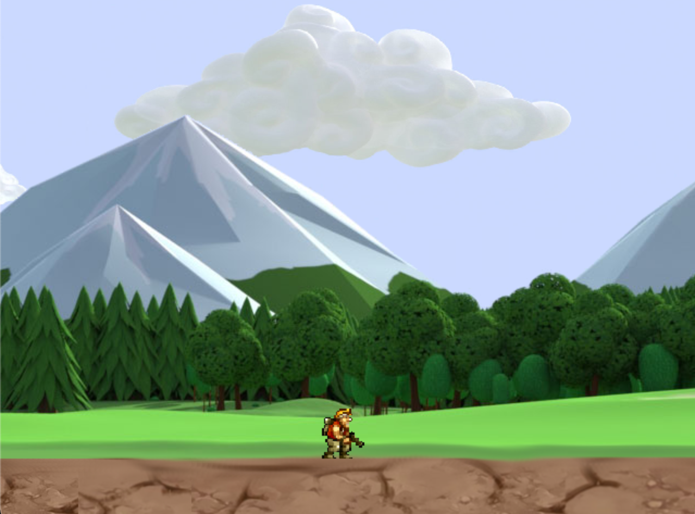
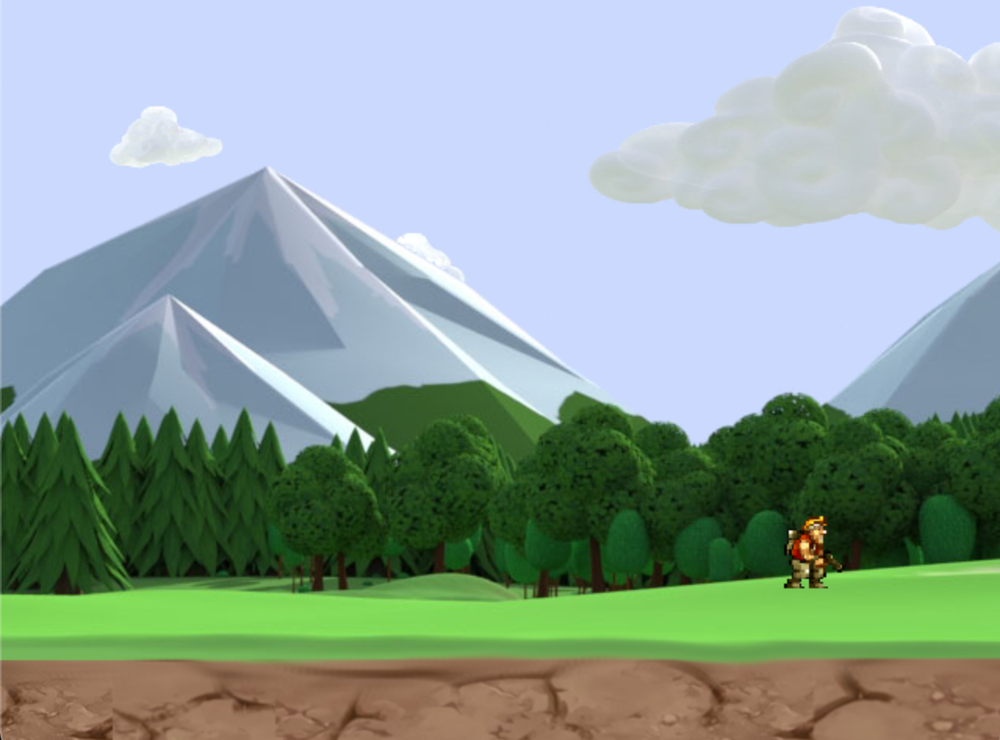

# Runner Gunner

Game in development

*I can only work on it when I have free time from school*

## How to install

**MAKE SURE YOU HAVE SDL INSTALLED!**

```
$ brew install sdl
```
or
><a href="https://www.libsdl.org/download-2.0.php">SDL2 Wiki</a>

If SDL is already installed
```
$ mkdir build
```
```
$ cd build
```
```
$ cmake ..
```
```
$ ./main
```

## How to Play



Pressing Left Key!!!


Pressing Space Key!!!

